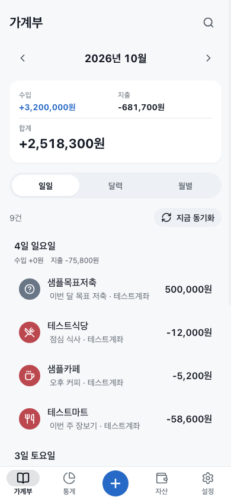
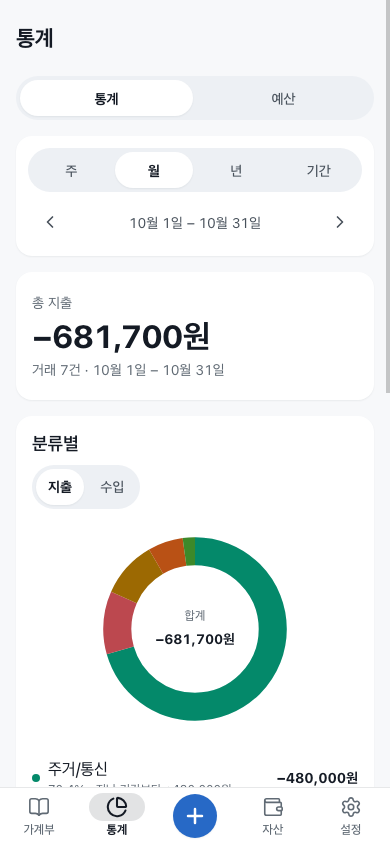
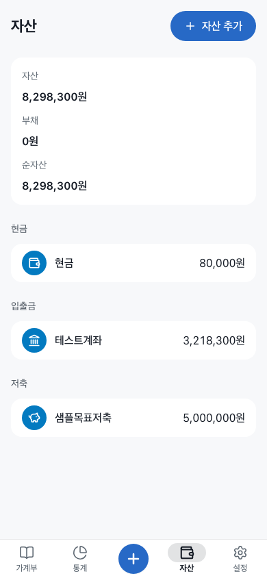

<p align="center"></p>

# ledger-app

혼자 쓰는 한국어 가계부 PWA예요. Mac에 데이터를 보관하고, 같은 Tailscale 네트워크의 폰·태블릿에서 홈 화면 앱처럼 사용해요.

수입·지출을 빠르게 적고, 내 계좌 사이의 이체는 지출과 구분해요. 잔액 기준일을 지정하면 이미 잔액에 포함된 과거 거래를 다시 더하지 않아요.

## 화면

아래 화면의 계좌, 거래처, 금액은 모두 합성 데이터예요.

| 가계부 | 통계 | 자산 |
| --- | --- | --- |
|  |  |  |

## 주요 기능

- 수입·지출·이체, 환불, 분류·메모·태그, 검색·기간 필터와 달력
- 은행에서 가져온 수입·지출을 거래 편집 화면의 "이체로 바꾸기"로 다른 자산(예: 맡긴 돈)과의 이체로 한 번에 바꾸기
- 월별 통계와 분류별 예산
- 계좌·현금·저축·기타 자산, 신용카드 결제 예정액과 체크카드 연결 계좌
- 자산별 시작 잔액과 선택 기준일: 기준일 이전 거래는 시작 잔액에 포함된 것으로 계산
- 반복 거래, 즐겨찾기 입력 템플릿
- CSV/XLSX 가져오기 미리보기·확정과 내보내기, JSON 백업·복원
- 연결이 끊겨도 기록·수정·삭제를 보관하는 오프라인 대기열
- 별도 읽기 전용 모듈을 통한 카카오뱅크 내역 반영, 중복 제거와 수동 수정 보존
- 밝은·어두운 테마, 폰·태블릿·데스크톱 레이아웃

## 빠른 시작

Bun 1.4.2 이상이 필요해요. 서버는 Bun + Hono + SQLite, 화면은 React + Vite예요.

```sh
git clone <이 저장소의 URL>
cd ledger-app
bun install --frozen-lockfile
bun run build
bun run start
```

`http://127.0.0.1:4340`에서 열어요. 처음 실행하면 `data/credentials.json`이 권한 `0600`으로 만들어져요. 파일을 비공개로 열어 `owner_token`을 로그인 화면에 입력하세요. 토큰을 터미널·로그·채팅에 출력하거나 파일을 공유하지 마세요.

설정 예제는 [`.env.example`](.env.example)에 있어요. Bun은 `.env`를 읽어요. 자동 수집 모듈은 이 저장소에 포함하지 않으며, 없으면 수집 상태에 오류가 표시되지만 수동 기록은 사용할 수 있어요.

개발할 때는 두 터미널에서 실행해요.

```sh
bun run start      # API: 127.0.0.1:4340
bun run dev        # Vite: 127.0.0.1:4341, /api를 서버로 전달
```

## 데이터와 접근 범위

주 데이터는 Mac의 SQLite에 저장해요. 이 앱은 별도 클라우드 데이터베이스를 사용하지 않아요. 오프라인 동작을 위해 접속한 브라우저에도 캐시와 변경 대기열이 남으므로 개인 기기에서 사용하세요.

- 수동 실행: `LEDGER_DATA_DIR`의 `ledger.sqlite`, 자격 증명, 백업
- Mac 운영 설치: `~/Library/Application Support/ledger-app/data`
- 운영 설치 시 저장소의 `data`는 운영 디렉터리를 가리키는 링크예요. 설치기는 기존 데이터나 다른 링크를 덮어쓰지 않아요.
- `data/`, `.env`, 운영 로그, 백업과 실제 거래 화면은 Git에 넣지 않아요.

서버는 루프백 주소에만 바인딩해요. 원격 접속은 Tailscale Serve의 `https:4340`을 사용하며 인터넷 공개용 Funnel은 쓰지 않아요. 쿠키 세션과 변경 요청의 Origin·CSRF 검사가 있어요. 여러 사용자의 데이터를 분리하는 서비스는 아니에요.

## 은행 내역 연결

은행 로그인·SMS 수신·엑셀 수집 프로그램은 포함하지 않아요. 이미 보유한 내역을 반환하는 신뢰할 수 있는 로컬 모듈을 `LEDGER_MODULE`로 지정해요. 앱은 `entries()`를 호출해 읽을 뿐, 원본 내역을 수정하지 않아요.

모듈은 동기 또는 비동기 `entries()`를 내보내며, 다음처럼 레코드 배열을 반환해요. 아래 예시는 합성 데이터예요.

```ts
export function entries() {
  return [{
    id: 1,
    at: "2026-03-15T12:00:00+09:00",
    account: "테스트계좌",
    kind: "출금",
    amount: -4500,
    counterparty: "샘플카페",
    balance: 995500,
    currency: "KRW",
    source: "sms",
  }];
}
```

정확한 형식은 [`server/importer/source.ts`](server/importer/source.ts)를 참고하세요. 가져온 거래의 수동 수정 필드는 잠겨서 다음 수집이 덮어쓰지 않아요. 같은 수신인에게 보냈다는 이유만으로 모두 같은 용도로 분류하지는 않아요.

## 환경 변수

| 이름 | 기본값 | 설명 |
| --- | --- | --- |
| `LEDGER_HOST` | `127.0.0.1` | `127.0.0.1`, `localhost`, `::1`만 허용 |
| `LEDGER_PORT` | `4340` | 서버 포트 |
| `LEDGER_DATA_DIR` | `./data` | SQLite·자격 증명·백업 위치 |
| `LEDGER_STATIC_DIR` | `./dist` | 빌드된 화면 위치 |
| `LEDGER_TAILSCALE_HOST` | 없음 | Serve의 `호스트:포트` |
| `LEDGER_TAILSCALE_LOGIN` | 없음 | 자동 인증을 허용할 본인 Tailscale 로그인 |
| `LEDGER_ALLOWED_ORIGINS` | 없음 | 추가 허용 Origin, 쉼표로 구분 |
| `LEDGER_MODULE` | `~/.local/share/ddolmeng-mode/bin/ledger.ts` | 현재 사용자 홈 기준 읽기 전용 수집 모듈 |
| `LEDGER_WATCH_DIR` | 모듈 옆 `../state/ledger` | 원본 변경 감시 디렉터리 |
| `LEDGER_IMPORT_INTERVAL_MS` | `60000` | 자동 수집 주기(ms) |

## Mac에서 상시 실행

`ops/`는 macOS LaunchAgent와 Tailscale Serve용 운영 도구예요. Bun, Tailscale, 작업 제한용 `heavy` 명령, 기본 위치의 읽기 전용 수집 모듈이 필요해요. `heavy`와 수집 모듈은 이 저장소에 포함하지 않아요. 이 조건이 없는 환경에서는 위 수동 실행을 사용하세요.

```sh
bash ops/install.sh --dry-run  # 계획·충돌 확인, 실제 설치 검증은 아님
bash ops/install.sh
bash ops/update.sh
```

런타임은 `~/Library/Application Support/ledger-app`에 두고, 자기 LaunchAgent `local.ledger-app`과 자기 Serve 포트만 관리해요. 설치기가 마지막에 보여 주는 주소를 같은 tailnet의 iPhone Safari에서 연 뒤 **공유 → 홈 화면에 추가**로 설치해요. iPad도 같아요.

업데이트 전에 DB와 자격 증명을 비공개로 백업하세요. `ops/update.sh --rollback`은 코드만 되돌려요. DB 스키마가 바뀌었다면 이전 코드와 그에 맞는 데이터 백업을 함께 복원해야 해요. 자세한 설치·백업·복원·제거 절차는 [런타임 문서](docs/runtime.md)에 있어요.

## 검증과 개발 문서

```sh
bun test
bunx tsc --noEmit
bunx biome check .
bun run build
bun run test:responsive
```

이 프로젝트의 운영 Mac에서는 전체 테스트·빌드·반응형 검증을 각각 `heavy bun test`, `heavy bun run build`, `heavy bun run test:responsive`로 실행해요. 동시 작업 한도를 우회하지 않아요.

반응형 검증은 Chrome/Chromium과 Bun.WebView를 사용해 합성 DB에서 320·375·390px의 화면·편집 시트·키패드·가로 넘침을 검사하고 자기 리소스를 정리해요. 실제 iPhone의 설치 상태바와 네이티브 공유 시트는 데스크톱 검증과 별도로 확인해야 해요.

- [API 계약](docs/API.md)
- [런타임·복원](docs/runtime.md)
- [디자인 규칙](DESIGN.md)
- [개발 작업 규칙](AGENTS.md)

## 한계

- 개인용 한국어·원화 가계부예요. 금융기관 원장, 다중 통화 회계나 세무 신고 도구가 아니에요.
- Mac이 꺼져 있거나 네트워크가 끊기면 새 동기화를 할 수 없어요. 오프라인 변경은 다시 연결된 뒤 반영해요.
- 분류·중복 판단은 보조 기능이에요. 원본 보고 잔액과 앱의 계산 잔액은 별개라 시작 잔액과 이체 목적을 확인해야 해요.
- 기준일은 한국 시간의 하루 시작이에요. 해당 날짜 이전 거래만 시작 잔액에 포함된 것으로 간주해요.
- 현재 패키지는 `0.0.1`이며 별도의 릴리스 안정성 보장을 뜻하지 않아요.

## 라이선스

[MIT License](LICENSE). 의존성은 각 패키지의 라이선스를 따라요.

## English

A Korean, single-owner personal-finance PWA built with Bun, Hono, SQLite, React and Vite. The primary database stays on your Mac; browser caches and an offline mutation queue support temporary disconnection. Optional bank ingestion reads a separately supplied local adapter. Remote access is through a private Tailscale network, not a public multi-user service.
